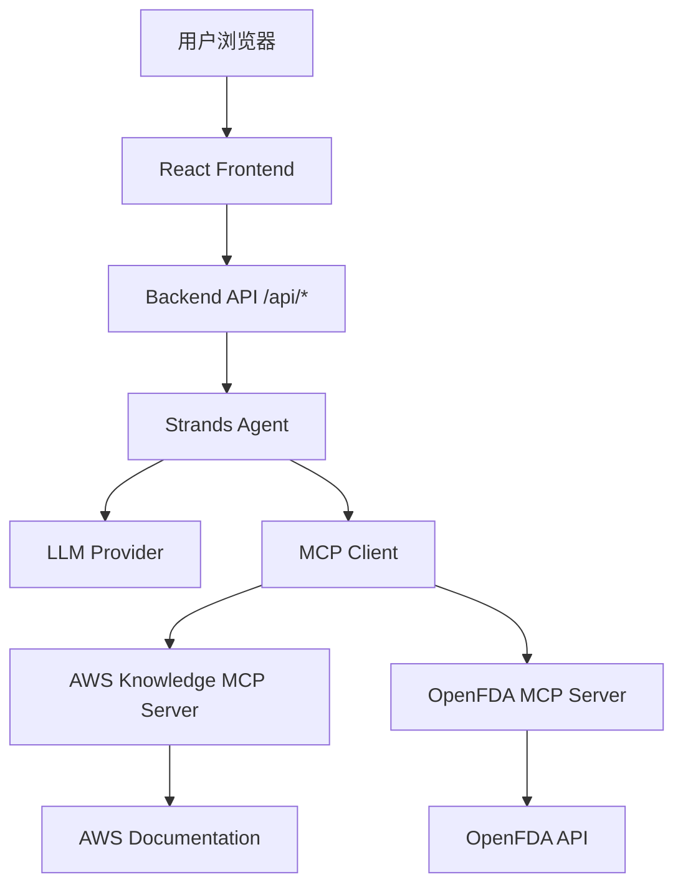

# Design Document

## Overview

本项目是一个用于 workshop 演示的 MCP (Model Context Protocol) chatbot 系统。系统采用前后端分离架构：

**前端**：使用 React 19.2 + TypeScript 5.9 + Vite 7.2 构建现代化聊天界面，采用 Tailwind CSS 4.0 + shadcn/ui 提供美观的 UI 设计，使用 Zustand 进行状态管理，支持 SSE 流式响应和实时消息更新。

**后端**：🔄 **部分完成** - 基于 Strands Agent SDK 构建智能代理服务，已集成 AWS Knowledge MCP server（HTTP），还需要集成 OpenFDA MCP server（本地 stdio）。Agent 能够智能地调用 MCP tools 查询 AWS 文档和 OpenFDA 药品数据并使用 LLM 生成回答。

**核心特性**：
- 流式响应（SSE）- 实时显示 AI 生成的内容
- 多轮对话 - 支持会话上下文管理
- MCP 工具调用 - 查询 AWS 知识库和 OpenFDA 药品数据
- 现代化 UI - 响应式设计，支持 Markdown 渲染和代码高亮
- 取消功能 - 用户可随时停止 AI 响应

## Architecture

### 系统架构图



### 技术栈

**Frontend:** (待实现)
- React 19.2 + TypeScript 5.9
- Vite 7.2 (构建工具)
- Tailwind CSS 4.0 (样式框架)
- shadcn/ui + Radix UI (组件库)
- Zustand 4.5 (状态管理)
- react-markdown 10.1 + remark-gfm 4.0 (Markdown 渲染)
- Lucide React (图标库)

**Backend:** 🔄 **部分完成**
- Python 3.11+
- FastAPI 0.115+ (Web 框架)
- Strands Agent SDK (AI Agent 框架)
- MCP Python SDK (MCP 客户端)
- Uvicorn (ASGI 服务器)
- Pydantic 2.0+ (数据验证)

**MCP Servers:**
- AWS Knowledge MCP Server - ✅ 已集成
- OpenFDA MCP Server - ❌ 待实现

## Components and Interfaces

### Backend Components

#### 1. FastAPI Application (`main.py`)

✅ **已实现** - 主应用入口，定义所有 API 路由。

```python
app = FastAPI(title="MCP Chatbot API")

@app.post("/api/chat")
async def chat(request: ChatRequest) -> StreamingResponse:
    """处理聊天请求，返回 SSE 流式响应"""

@app.get("/api/info")
async def get_info() -> InfoResponse:
    """获取模型信息和可用工具列表"""

@app.get("/api/health")
async def health_check() -> HealthResponse:
    """健康检查端点，返回服务状态和 MCP servers 连接状态"""
```

**关键实现要点**：
- ✅ 配置 CORS middleware 允许前端访问
- ✅ `/api/chat` 返回 `text/event-stream` 格式的 SSE 响应
- ✅ `/api/info` 返回模型信息和工具列表
- ✅ `/api/health` 返回 MCP servers 连接状态

#### 2. Agent Service (`agent_service.py`)

✅ **已实现** - 封装 Strands Agent 的服务层。

```python
class AgentService:
    def __init__(self):
        self.model = BedrockModel(
            model_id="us.anthropic.claude-sonnet-4-20250514-v1:0",
            temperature=0.7,
            max_tokens=4096
        )
        self.agent = None
    
    async def initialize_agent(self, mcp_clients: List[MCPClient]):
        """使用 Managed Integration 初始化 agent"""
    
    async def process_message(self, messages: list, session_id: str) -> AsyncGenerator:
        """处理用户消息并返回流式响应"""
```

**关键实现要点**：
- ✅ 使用 Bedrock Claude Sonnet 4 模型
- ✅ 使用 Strands **Managed Integration** 方式集成 MCP tools
- ✅ 支持流式响应（AsyncGenerator）
- ✅ 自动处理 Agent 的工具调用请求

#### 3. MCP Client Manager (`mcp_client_manager.py`)

🔄 **部分完成** - 管理 MCP server 连接和工具调用。

**当前状态**：
```python
class MCPClientManager:
    def __init__(self):
        self.clients: Dict[str, MCPClient] = {}
        self.server_configs = {
            "aws-knowledge": {  # ✅ 已实现
                "type": "streamablehttp",
                "url": "https://knowledge-mcp.global.api.aws"
            }
            # ❌ 需要添加 OpenFDA 配置
        }
```

**需要扩展**：
```python
self.server_configs = {
    "aws-knowledge": {
        "type": "streamablehttp",
        "url": "https://knowledge-mcp.global.api.aws"
    },
    "openfda": {  # ❌ 待添加
        "type": "stdio",
        "command": "openfda-mcp-server"
    }
}
```

**关键实现要点**：
- ✅ 使用 `streamablehttp_client` 连接 AWS Knowledge MCP server
- ❌ 需要添加 `stdio_client` 连接 OpenFDA MCP server
- ✅ 启动时初始化 servers，失败时记录错误但不中断
- ✅ 提供统一的 client 管理接口

#### 4. API Routes (`routers/chat.py`)

✅ **已实现** - 处理 HTTP 请求和 SSE 响应。

**关键实现要点**：
- ✅ POST `/api/chat` - SSE 流式聊天接口
- ✅ GET `/api/info` - 模型和工具信息
- ✅ GET `/api/health` - 健康检查
- ✅ 正确的 SSE 事件格式和错误处理

#### 5. Data Models (`models.py`)

✅ **已实现** - Pydantic 数据模型定义。

### OpenFDA MCP Server (待实现)

#### 1. Server Structure

```
openfda-mcp-server/
├── src/
│   └── openfda_mcp/
│       ├── __init__.py          # Package entry point
│       ├── __main__.py          # 支持 python -m openfda_mcp
│       ├── server.py            # MCP server 和 tool 定义
│       ├── tool_handlers.py     # Business logic handlers
│       └── http_client.py       # HTTP client 实现
├── pyproject.toml               # 项目配置
└── README.md                    # 文档
```

#### 2. Core Tools

**需要实现的工具**：
- `search_drug_label` - 搜索药品标签信息
- `get_drug_adverse_events` - 获取药品不良反应报告
- `count_adverse_events` - 获取不良反应统计数据

#### 3. Implementation Requirements

- 使用 FastMCP framework 定义 MCP server
- 支持 Lucene 查询语法
- 统一的错误处理和响应格式
- 详细的工具文档和参数说明

### Frontend Components (待实现)

#### 1. App Layout (应用布局)

两栏布局的主容器组件。

```typescript
// 布局结构：
// - 左侧栏（固定宽度 280px）：Sidebar 组件
// - 右侧主区域（flex-1）：ChatWindow 组件
```

#### 2. Sidebar (左侧栏)

显示模型信息和可用工具列表。

```typescript
interface SidebarProps {
  className?: string;
}

// 职责：
// - 显示当前模型信息（名称、Region）
// - 显示已连接的 MCP servers 和可用工具
// - 使用 ✓ 标记表示连接状态
// - 调用 GET /api/info 获取数据
```

#### 3. ChatWindow (主聊天窗口)

主聊天界面组件，负责显示消息历史、管理自动滚动和协调子组件。

#### 4. MessageItem (消息项)

单条消息显示组件，支持 Markdown 渲染和代码高亮。

#### 5. InputArea (输入区域)

用户输入组件，处理消息发送和取消操作。

#### 6. EmptyState (空状态)

聊天窗口为空时显示的欢迎界面。

### Frontend Hooks (待实现)

#### 1. useStreamingChat

管理 SSE 流式聊天的核心 Hook。

#### 2. useAutoScroll

管理聊天窗口自动滚动的 Hook。

### Frontend State (Zustand) (待实现)

使用 Zustand 管理全局聊天状态。

## Data Models

### Frontend Data Models (待实现)

```typescript
// 前端消息类型（用于 UI 显示）
interface Message {
  id: string;
  role: 'system' | 'user' | 'assistant';
  content: string;
  timestamp: Date | string;
  isStreaming?: boolean;
  metadata?: Record<string, any>;
}

// SSE 流式事件类型
interface StreamEvent {
  type: 'content' | 'status' | 'tool' | 'complete' | 'error';
  data: string;
  metadata?: {
    session_id?: string;
    agent_id?: string;
    [key: string]: any;
  };
}

// Chat API 请求类型
interface ChatRequest {
  messages: Array<{
    role: 'system' | 'user' | 'assistant';
    content: string;
  }>;
  context?: Record<string, any>;
  session_id?: string;
}
```

### Backend Data Models (已完成)

✅ **已实现** - 在 `models.py` 中定义了完整的 Pydantic 模型。

## Key Implementation Requirements

### Backend Requirements

🔄 **部分完成**：
- ✅ API 接口 - 标准 Chat API 请求/响应格式
- ✅ 流式响应 - SSE 事件流实现
- ✅ Strands Agent 集成 - Managed Integration 方式
- 🔄 MCP Server 管理 - 仅 AWS Knowledge，需要添加 OpenFDA

❌ **待完成**：
- OpenFDA MCP server 集成
- 双 MCP server 的工具调用路由

### Frontend Requirements (待实现)

**消息处理**：
- 消息发送后立即显示在界面（乐观更新）
- 空消息或仅包含空白字符应被拒绝
- 加载时禁用输入框和发送按钮
- 用户消息右对齐，AI 消息左对齐
- 使用不同的背景色区分用户和 AI 消息

**流式响应**：
- 消息内容为空时显示加载状态
- 使用 `useRef` 累积内容，减少状态更新频率
- 对于 `isStreaming` 的消息，直接使用 `streamingContent` 替换内容，避免重复显示
- 支持取消正在进行的响应（AbortController）
- 取消时保留已接收的部分内容

**自动滚动**：
- 新消息添加时自动滚动到底部
- 用户手动向上滚动时停止自动滚动
- 距离底部 50px 内恢复自动滚动
- 使用 `requestAnimationFrame` 优化滚动性能

**Markdown 渲染**：
- AI 消息使用 `react-markdown` + `remark-gfm` 渲染
- 支持代码块语法高亮
- 禁用 HTML 渲染防止 XSS

**布局**：
- 外层容器使用 `h-screen` 占满视口
- 消息区域使用 `flex-1 overflow-y-auto`
- 输入区域使用 `flex-shrink-0` 防止被压缩
- 内容宽度限制放在内部元素（如 `max-w-4xl mx-auto`）

## Error Handling

### Backend Error Handling

🔄 **部分完成**：
- ✅ MCP Server 连接错误 - AWS Knowledge 已实现优雅降级
- ✅ Agent 处理错误 - 已实现错误捕获和 SSE error 事件
- ✅ 数据验证错误 - 使用 Pydantic 进行请求验证
- ✅ SSE Generation Errors - 发送 error 事件到客户端

❌ **待完成**：
- OpenFDA MCP server 连接错误处理

### Frontend Error Handling (待实现)

1. **Network Errors** - Catch fetch errors, display user-friendly error message
2. **SSE Connection Errors** - Handle connection drops, distinguish AbortError
3. **JSON Parse Errors** - Log malformed events, continue processing
4. **State Update Errors** - Use try-catch in Zustand actions
5. **Input Validation** - Validate message not empty, trim whitespace

## Configuration

### Port Configuration

**标准端口分配**：
- **Backend API**: `8000` (FastAPI/Uvicorn 默认端口)
- **Frontend Dev Server**: `5173` (Vite 默认端口)
- **Frontend Production**: `/proxy/5173/` (Nginx 静态文件服务)

**开发环境**：
- Backend: `http://localhost:8000`
- Frontend: `http://localhost:5173`
- Frontend 通过 Vite proxy 访问 Backend API

**生产环境**：
- Backend: `http://127.0.0.1:8000` (Nginx 反向代理)
- Frontend: `https://domain.com/proxy/5173/` (Nginx 静态文件)
- API: `https://domain.com/api/` (Nginx 代理到 Backend)

### Backend Configuration

🔄 **部分完成** - 环境变量 (`.env.example`)：

```bash
# AWS Bedrock
AWS_REGION=us-east-1
AWS_BEDROCK_MODEL_ID=us.anthropic.claude-sonnet-4-20250514-v1:0

# Server
PORT=8000
HOST=0.0.0.0
CORS_ORIGINS=http://localhost:5173,http://localhost:3000
LOG_LEVEL=INFO

# MCP Servers
AWS_KNOWLEDGE_MCP_URL=https://knowledge-mcp.global.api.aws
# ❌ 需要添加：OPENFDA_API_KEY=your_api_key_here
```

### Frontend Configuration (待实现)

**关键配置文件**：

1. **vite.config.ts** - 必须添加 `@tailwindcss/vite` 插件（Tailwind CSS 4.0 要求）
   ```typescript
   server: {
     port: 5173,  // Vite 默认端口
     host: '0.0.0.0',
     proxy: {
       '/api': {
         target: 'http://localhost:8000',  // Backend 端口
         changeOrigin: true,
       },
     },
   }
   ```

2. **tailwind.config.ts** - 扩展主题颜色（使用 CSS 变量）
3. **src/index.css** - 使用 `@import "tailwindcss"` 而不是 `@tailwind` 指令
4. **components.json** (shadcn/ui) - 配置组件样式和路径别名

**环境变量** (`.env.example`)：
```bash
# API Base URL
VITE_API_BASE_URL=http://localhost:8000

# 生产环境使用相对路径
# VITE_API_BASE_URL=/api
```

## Project Structure

```
mcp-chatbot-workshop/
├── frontend/                 # ❌ 待实现 - React 前端应用
│   ├── src/
│   │   ├── components/      # UI 组件
│   │   ├── hooks/          # React Hooks
│   │   ├── store/          # Zustand 状态管理
│   │   ├── api/            # API 客户端
│   │   └── types/          # TypeScript 类型定义
│   ├── components.json
│   ├── tailwind.config.ts
│   ├── tsconfig.json
│   ├── vite.config.ts
│   └── package.json
├── backend/                 # 🔄 部分完成 - FastAPI 后端服务
│   ├── main.py             # ✅ 应用入口
│   ├── models.py           # ✅ Pydantic 模型
│   ├── agent_service.py    # ✅ Agent 服务
│   ├── mcp_client_manager.py # 🔄 需要添加 OpenFDA 支持
│   ├── routers/
│   │   └── chat.py         # ✅ API 路由
│   ├── requirements.txt    # 🔄 需要添加 OpenFDA MCP server 依赖
│   ├── .env.example        # 🔄 需要添加 OpenFDA 配置
│   ├── start.sh            # ✅ 启动脚本
│   ├── stop.sh             # ✅ 停止脚本
│   └── README.md           # ✅ Backend 文档
└── openfda-mcp-server/     # ❌ 待实现 - OpenFDA MCP Server
    └── src/openfda_mcp/
        ├── server.py       # MCP server 定义
        ├── tool_handlers.py # 业务逻辑处理
        └── http_client.py  # HTTP 客户端
```

## Performance Considerations

### Backend Optimization

🔄 **部分完成**：
- ✅ Async streaming - 使用 async generators 实现 SSE
- ✅ Connection management - AWS Knowledge MCP client 连接管理
- ✅ Resource limits - 设置超时和错误处理

❌ **待完成**：
- OpenFDA MCP server 连接管理和健康检查

### Frontend Optimization (待实现)

1. **React.memo** - Memoize MessageItem 避免重渲染
2. **useRef accumulation** - 累积流式内容，50ms 节流更新
3. **requestAnimationFrame** - 优化滚动性能
4. **Code splitting** - 懒加载 markdown renderer
5. **useMemo** - 缓存 markdown 渲染结果

## Current Status

### ✅ Completed
- FastAPI 应用框架和 API 路由
- Strands Agent 集成（Managed Integration）
- AWS Knowledge MCP server 连接
- SSE 流式响应实现
- 数据模型和错误处理
- 服务管理脚本和基础文档

### 🔄 Partially Completed
- Backend MCP Client Manager（仅支持 AWS Knowledge）
- Backend 环境配置（缺少 OpenFDA 配置）

### ❌ Pending
- OpenFDA MCP Server 完整实现
- Backend OpenFDA 集成
- React 前端应用完整实现

### 🎯 Next Steps
1. 实现 OpenFDA MCP Server（server.py, tool_handlers.py, http_client.py）
2. 扩展 Backend MCP Client Manager 支持 OpenFDA
3. 初始化 Frontend 项目（Vite + React + TypeScript）
4. 实现核心 UI 组件和状态管理
5. 集成 SSE 流式响应
6. 完善样式和用户体验
