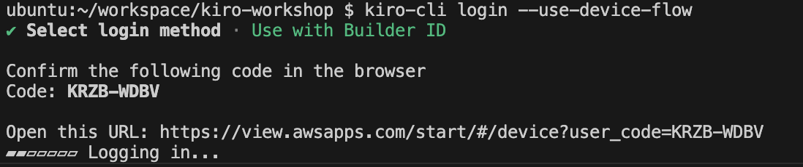
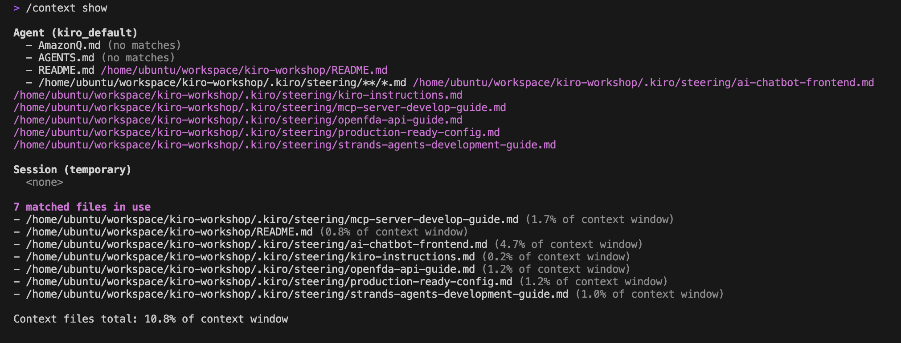
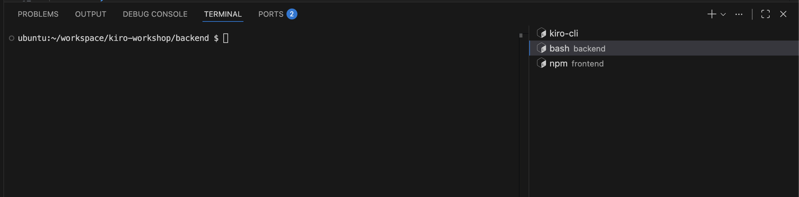
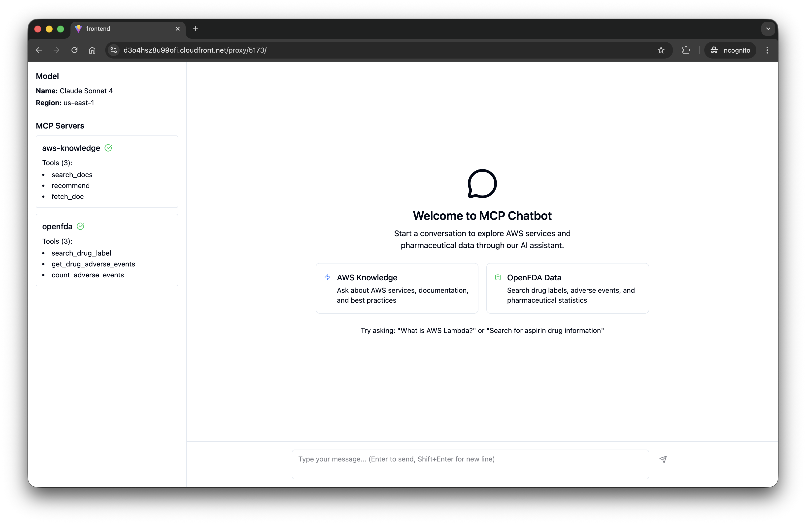

# MCP Chatbot Workshop - Step by Step Guide

> 使用 Kiro CLI 构建一个完整的 MCP 集成聊天应用

## 📋 Workshop 概述

本 workshop 将带你体验使用 Kiro CLI 的 Spec Mode 开发一个完整的 AI 聊天应用，该应用集成了：
- **AWS Knowledge MCP Server** - 查询 AWS 文档
- **OpenFDA MCP Server** - 查询 FDA 药品信息
- **Strands Agent SDK** - 智能 AI 代理
- **React + TypeScript** - 现代化前端界面

**预计时间**: 2-3 小时

---


## 第一部分：环境准备和登录

### 1.1 Workshop 账号登录

https://catalog.us-east-1.prod.workshops.aws/workshops/449f939b-3480-44eb-a864-6abe94d03b82/zh-CN/prerequisite/register

### 1.2 当前环境介绍

**环境架构**:
```
CloudFront (HTTPS) → EC2 (Nginx) → VSCode Server + Services
     │                    │              │
     └─ /proxy/8080/      ├─ VSCode Server (Port 8080)
     └─ /proxy/5173/      ├─ Frontend (Port 5173)
     └─ /api/             └─ Backend API (Port 8000)
```

**已安装的工具**:
- ✅ Python 3.11+
- ✅ Node.js 18+
- ✅ AWS CLI (已配置)
- ✅ Git
- ✅ Docker
- ✅ VSCode Server

**项目目录结构**:
```bash
# 查看项目结构
tree -L 2
```

---

## 第二部分：Kiro CLI 设置

### 2.1 Kiro CLI 登录


#### 步骤

1. **启动认证流程**
   ```bash
   kiro-cli login --use-device-flow
   ```

2. **选择认证方式**
   ```
   ? Select login method ›
   ❯ Use with Builder ID
     Use with IDC Account
   ```

   选择 **Use with Builder ID**

3. **完成浏览器认证**
   
   CLI 会显示设备码和 URL：
   ```
   Confirm the following code in the browser
   Code: XXXX-XXXX
   
   Open this URL: https://view.awsapps.com/start/#/device?user_code=XXXX-XXXX
   ▓▓▓▓▓▓ Logging in...
   ```
   
   认证步骤：
   - 打开浏览器访问显示的 URL
   - 使用 Builder ID 登录
   - 授权 Kiro CLI 访问

   

4. **验证登录状态**
   ```bash
   kiro-cli whoami
   ```

---


## 第三部分：Kiro CLI 基础使用

### 3.1 使用简单的 Kiro CLI 命令


#### 步骤

1. **启动 Kiro CLI 交互式会话（首次）**
   ```bash
   kiro-cli chat
   ```

   你会看到 Kiro CLI 的提示符：
   ```
   kiro-cli>
   ```

2. **查看上下文信息**
   ```
   kiro-cli> /context show
   ```

   这会显示当前会话的上下文使用情况:

   

3. **查看可用工具**
   ```
   kiro-cli> /tools
   ```

   这会列出所有可用的工具，例如：
   - `@builtin/read` - 读取文件
   - `@builtin/write` - 写入文件
   - `@builtin/shell` - 执行 shell 命令
   - MCP tools (如果已配置)

4. **测试简单对话**
   ```
   kiro-cli> 你好，请介绍一下这个项目
   ```

   Kiro 会分析项目结构并给出回答。

5. **退出会话**
   ```
   kiro-cli> /exit
   ```
   或按 `Ctrl+D`

### 3.2 使用 Kiro CLI 分析当前项目


#### 步骤

1. **恢复会话**
   ```bash
   kiro-cli chat --resume
   ```

2. **请求项目分析**
   ```
   kiro-cli> 请分析当前项目的结构和实现状态，包括：
   1. 已完成的功能
   2. 待实现的功能
   3. 技术栈
   4. 项目架构
   ```

3. **查看 Spec 文档**
   ```
   kiro-cli> 请读取 .kiro/specs/mcp-chatbot-workshop/ 目录下的所有文档，
   并总结项目的需求、设计和任务列表
   ```

4. **理解项目目标**
   
   Kiro 会告诉你：
   - ✅ Backend 基础架构已完成（80%）
   - ❌ OpenFDA MCP Server 待实现（0%）
   - ❌ Frontend 待实现（0%）
   - 📋 共有 9 个主要任务需要完成

### 3.3 查看当前项目的 Steering


#### 步骤

1. **列出 Steering 文件**
   ```bash
   ls -la .kiro/steering/
   ```

   你会看到：
   ```
   strands-agents-development-guide.md    # Strands Agent 开发指南
   openfda-api-guide.md                   # OpenFDA API 使用指南
   mcp-server-develop-guide.md            # MCP Server 开发指南
   ai-chatbot-frontend.md                 # 前端开发指南
   production-ready-config.md             # 生产环境配置指南
   ```

2. **在 Kiro CLI 中查看 Steering**
   ```
   kiro-cli> 请总结 .kiro/steering/ 目录下的所有开发指南，
   重点说明关键的最佳实践和注意事项
   ```

3. **理解关键要点**
   
   Kiro 会总结：
   - **Strands Agent**: 使用 Managed Integration 方式
   - **OpenFDA API**: 必须使用 Lucene 查询语法
   - **MCP Server**: 三层架构模式
   - **Frontend**: Tailwind CSS 4.0 配置要点

---


## 第四部分：实现需求（核心开发）

### 4.1 开始实现需求 - Task 1

```bash
kiro-cli chat --resume
```

```
kiro-cli> 根据 .kiro/specs/mcp-chatbot-workshop 的需求，开始执行 task1，并在完成之后更新 task 状态
```

**注意事项**：
- 在实现过程中，Kiro 可能会询问是否执行命令
- 选择 `y` 执行命令，`n` 拒绝命令，或者直接输入需求告诉kiro-cli接下来要做什么
- 本次 workshop 不使用 `t` 选项

### 4.2 按顺序完成 Task 2-9

Task 1 完成之后，按照顺序依次执行 task 2-9：

```
kiro-cli> 继续完成 task2，并在完成之后更新 task 状态
```

```
kiro-cli> 继续完成 task3，并在完成之后更新 task 状态
```

```
kiro-cli> 继续完成 task4，并在完成之后更新 task 状态
```

以此类推，直到完成所有 9 个任务。

---


## 第五部分：前后端联调和测试

### 5.1 启动完整应用


#### 步骤

1. **打开两个终端窗口**
   
   在 VSCode Server 中：
   - 终端 1: 用于后端服务
   - 终端 2: 用于前端服务

   

2. **启动后端服务**
   
   在终端 1 中：
   ```bash
   cd ./backend
   ./start.sh
   ```

3. **验证后端健康状态**
   
   ```bash
   # 检查健康状态
   curl http://localhost:8000/api/health
   
   # 检查模型和工具信息
   curl http://localhost:8000/api/info
   ```

4. **启动前端服务**
   
   在终端 2 中：
   ```bash
   cd ./frontend
   npm run dev
   ```

5. **访问应用**
   
   通过 CloudFront 访问：
   ```
   https://[your-cloudfront-domain]/proxy/5173/
   ```

   

### 5.2 功能测试


#### 测试用例

1. **测试 AWS Knowledge 查询**
   
   在聊天框中输入：
   ```
   什么是 AWS 的 WA？
   ```

2. **测试 OpenFDA 查询**
   
   在聊天框中输入：
   ```
   告诉我阿司匹林的药品标签信息
   ```

3. **测试综合查询**
   
   在聊天框中输入：
   ```
   我希望使用 aws 快速构建一个药品不良反应查询的 api service，应该怎么做？
   ```

### 5.3 调试常见问题

如果调试过程中遇到各种错误，可以将错误信息贴给 kiro-cli 让它分析并修复：

```
kiro-cli> [粘贴错误信息] 帮我仅分析这个问题的原因
```

```
kiro-cli> [粘贴错误信息] 帮我修复这个问题
```

#### 前端截图分析

如果遇到 UI 问题，可以截图让 Kiro 分析：

1. **截图并保存**
   ```bash
   # 将截图保存到 frontend/ 目录
   # 例如: frontend/ui-issue.png
   ```

2. **让 Kiro 分析**
   ```
   kiro-cli> frontend/ui-issue.png 
   
   读取这个截图并分析前端 UI 的问题，包括：
   1. 布局是否正确
   2. 样式是否符合设计
   3. 是否有明显的错误
   4. 如何修复
   ```

---


## 第六部分：扩展功能（可选）


### 选项 1: 添加单元测试和自动化测试


#### 步骤

1. **创建测试 Spec**
   ```bash
   mkdir -p .kiro/specs/testing
   ```

2. **使用 Kiro 生成测试需求**
   ```
   kiro-cli> 我想为这个项目添加单元测试和自动化测试。
   
   请帮我：
   1. 创建 .kiro/specs/testing/requirements.md
   2. 列出需要测试的模块和功能
   3. 定义测试策略（单元测试、集成测试、E2E 测试）
   4. 使用 EARS 格式编写测试需求
   ```

3. **生成测试设计**
   ```
   kiro-cli> 基于 requirements.md，请生成 design.md，包括：
   1. 测试框架选择（pytest, jest, playwright 等）
   2. 测试目录结构
   3. Mock 策略
   4. CI/CD 集成方案
   ```

4. **生成测试任务**
   ```
   kiro-cli> 基于 requirements.md 和 design.md，生成 tasks.md，
   包括详细的测试实现任务列表
   ```

5. **实现测试**
   ```
   kiro-cli> 请开始实现 tasks.md 中的测试任务
   ```

**预期成果**:
- ✅ Backend 单元测试（pytest）
- ✅ Frontend 单元测试（vitest）
- ✅ API 集成测试
- ✅ E2E 测试（playwright）
- ✅ CI/CD 配置（GitHub Actions / GitLab CI）

### 选项 2: Docker 容器化和 AWS 部署


#### 步骤

1. **创建部署 Spec**
   ```bash
   mkdir -p .kiro/specs/deployment
   ```

2. **生成部署需求**
   ```
   kiro-cli> 我想将这个应用容器化并部署到 AWS ECS + ALB。
   
   请帮我创建 .kiro/specs/deployment/requirements.md，包括：
   1. Docker 容器化需求
   2. AWS 基础设施需求（ECS, ALB, VPC, Security Groups）
   3. CI/CD 流水线需求
   4. 监控和日志需求
   ```

3. **生成部署设计**
   ```
   kiro-cli> 基于 requirements.md，生成 design.md，包括：
   1. Dockerfile 设计（多阶段构建）
   2. docker-compose.yml 设计
   3. AWS 架构图（使用 Mermaid）
   4. Terraform/CDK 基础设施代码设计
   5. 部署流程设计
   ```

4. **生成部署任务**
   ```
   kiro-cli> 生成 tasks.md，包括：
   1. 创建 Dockerfile
   2. 创建 docker-compose.yml
   3. 本地容器测试
   4. 创建 AWS 基础设施代码
   5. 配置 CI/CD 流水线
   6. 部署到 AWS
   ```

5. **实现部署**
   ```
   kiro-cli> 请开始实现 tasks.md 中的部署任务
   ```

**预期成果**:
- ✅ Dockerfile（前端 + 后端）
- ✅ docker-compose.yml（本地开发）
- ✅ AWS 基础设施代码（Terraform 或 CDK）
- ✅ CI/CD 流水线（自动构建和部署）
- ✅ 生产环境运行的应用

**架构示例**:
```
Internet → CloudFront → ALB → ECS Fargate
                         │      ├─ Frontend Container
                         │      └─ Backend Container
                         └─ RDS (可选，用于持久化)
```

### 选项 3: 添加新功能


#### 功能选项

**3.1 后端切换模型**

```
kiro-cli> 我想添加一个功能：允许用户在前端选择不同的 LLM 模型。

请帮我：
1. 创建 .kiro/specs/model-selection/ 目录
2. 生成 requirements.md（支持多个模型的需求）
3. 生成 design.md（后端 API 设计、前端 UI 设计）
4. 生成 tasks.md 并开始实现
```

**预期成果**:
- ✅ 后端支持多个模型配置
- ✅ 前端模型选择下拉菜单
- ✅ 动态切换模型

**3.2 用户认证和历史记录持久化**

```
kiro-cli> 我想添加用户认证和对话历史持久化功能。

请帮我：
1. 创建 .kiro/specs/auth-and-persistence/ 目录
2. 生成 requirements.md（用户注册、登录、历史记录需求）
3. 生成 design.md（数据库设计、API 设计、认证流程）
4. 生成 tasks.md 并开始实现
```

**预期成果**:
- ✅ 用户注册和登录（JWT 认证）
- ✅ 对话历史保存到数据库（PostgreSQL / DynamoDB）
- ✅ 历史记录查看和搜索
- ✅ 会话管理

**3.3 配置 MCP Server 功能**

```
kiro-cli> 我想添加一个功能：允许用户在前端配置和添加新的 MCP servers。

请帮我：
1. 创建 .kiro/specs/mcp-config/ 目录
2. 生成 requirements.md（动态配置 MCP server 的需求）
3. 生成 design.md（配置 UI、后端 API、MCP 连接管理）
4. 生成 tasks.md 并开始实现
```

**预期成果**:
- ✅ MCP Server 配置界面
- ✅ 添加/删除/编辑 MCP servers
- ✅ 测试 MCP 连接
- ✅ 动态加载 MCP tools

**3.4 修改系统提示词功能**

```
kiro-cli> 我想添加一个功能：允许用户自定义 Agent 的系统提示词。

请帮我：
1. 创建 .kiro/specs/custom-prompt/ 目录
2. 生成 requirements.md（自定义提示词的需求）
3. 生成 design.md（提示词编辑器、预设模板、API 设计）
4. 生成 tasks.md 并开始实现
```

**预期成果**:
- ✅ 系统提示词编辑器
- ✅ 预设提示词模板
- ✅ 提示词预览和测试
- ✅ 保存和加载自定义提示词

---

